<p align="center">
  <a href="https://auf-zu-neuen-welten.de">
    
  </a>
</p>



<p align="center">
  <a href="https://auf-zu-neuen-welten.de"></a>
  &nbsp;
  <a href="https://auf-zu-neuen-welten.de/#contact"></a>
</p>

<br/>


I build web and mobile apps that go into production and stay there. Frontends with
Angular and Ionic, backends with NestJS — from internal dashboards to Play Store apps
with thousands of users.

```ts
import { Component, signal } from '@angular/core';

@Component({
  selector: 'benjamin-milcic',
  template: `<router-outlet />`,
})
export class BenjaminMilcic {
  readonly role    = 'Freelance Full-Stack Developer';
  readonly based   = 'Germany';
  readonly since   = 2019;                 // first professional Angular line
  readonly coding  = 'since my teens';     // HTML, CSS, JavaScript, PHP
  readonly speaks  = { de: 'native', en: 'fluent', hr: 'advanced' };
  readonly offDuty = ['husband', 'father of one'];

  readonly availability = signal<'open' | 'booked'>('open');

  ship(idea: Idea): Observable<Product> {
    return of(idea).pipe(
      map(this.understand),   // what is the actual problem?
      map(this.question),     // requirements are rarely final
      map(this.build),        // typed, componentised, tested
      map(this.maintain),     // still readable in two years
    );
  }
}
```

> Ten years of software development taught me one thing: **code is only half the
> battle.** The other half is understanding the problem, questioning the requirements,
> and delivering something that is still maintainable two years from now.

<br/>


<br/>


### Auf zu neuen Welten

<a href="https://auf-zu-neuen-welten.de">
  
</a>

My homepage, portfolio and permanent construction site — and the source of the
graphics you are looking at right now.

Angular 20 with standalone components and signals, lazy-loaded routes throughout,
i18n in German, English and Croatian, full-text search across the whole site,
deployed behind Cloudflare Workers. A NestJS API does the heavy lifting.

Public on purpose: the code is part of the portfolio.

<a href="https://auf-zu-neuen-welten.de"></a>
<a href="https://github.com/benjaminmilcic/aznw-routes"></a>
<a href="https://github.com/benjaminmilcic/nest-aznw-api"></a>

<br clear="all"/>
<br/>

### Vocabulary Trainer

Web and Android app for learning Croatian — one Angular/Ionic codebase, two
platforms, Firebase behind it. Built because I wanted the thing to exist.

<a href="https://learn-croatian-86b00.web.app/"></a>
<a href="https://github.com/benjaminmilcic/learn-croatian"></a>
<a href="https://raw.githubusercontent.com/benjaminmilcic/learn-croatian/master/apk/learn-croatian.apk"></a>

<br/>

### Game Collection

A handful of well-known multiplayer games with realtime sync — Angular + Firebase.
Play against someone sitting in another browser.

<a href="https://whiteboard-32486.web.app/"></a>
<a href="https://github.com/benjaminmilcic/whiteboard"></a>

<br/>


Every idea I want to try lands in the gimmicks section of my site instead of dying in
a scratch folder. It doubles as a testbed — if something new shows up in one of my
client projects, chances are it was tried out here first.


<p align="center">
  <a href="https://auf-zu-neuen-welten.de/gimmicks"></a>
</p>

<br/>


**[Solakon](https://www.solakon.de)** — iOS and Android app that integrates balcony
power plants into the home energy network. Angular + Ionic.

<a href="https://www.solakon.de"></a>
<a href="https://play.google.com/store/apps/details?id=de.solakon.app"></a>

**[HippoData](https://login.hippodata.de)** — B2B platform for planning and evaluating
show jumping and riding tournaments. Angular, a lot of domain logic, a lot of edge cases.

<a href="https://login.hippodata.de"></a>

**[Webaro](https://webaro.de)** — dashboard for Weber Agrar Robotics: planning and
evaluation of agricultural drone data, with live data streaming in. Angular.

<a href="https://webaro.de"></a>

**[CatchCups](https://catchcups.com)** — mobile app that evaluates measurement data
from lawn irrigation systems. Angular + Ionic.

<a href="https://catchcups.com"></a>
<a href="https://play.google.com/store/apps/details?id=de.codext.catchcup"></a>

<br/>


Working on something and wondering whether I'm a fit? Tell me the stack, the timeline
and roughly the budget — the more specific, the better. I usually answer within a day.

<p align="center">
  <a href="mailto:benjamin.milcic@gmail.com"></a>
  &nbsp;
  <a href="https://auf-zu-neuen-welten.de/#contact"></a>
  &nbsp;
  <a href="https://stackoverflow.com/users/20271366/benjamin"></a>
</p>

<br/>


<p align="center">
  <sub><i>Every graphic on this page is hand-built SVG — <code>node tools/build-assets.mjs</code>.</i></sub><br/>
  <sub><b>~ auf zu neuen Welten</b></sub>
</p>
